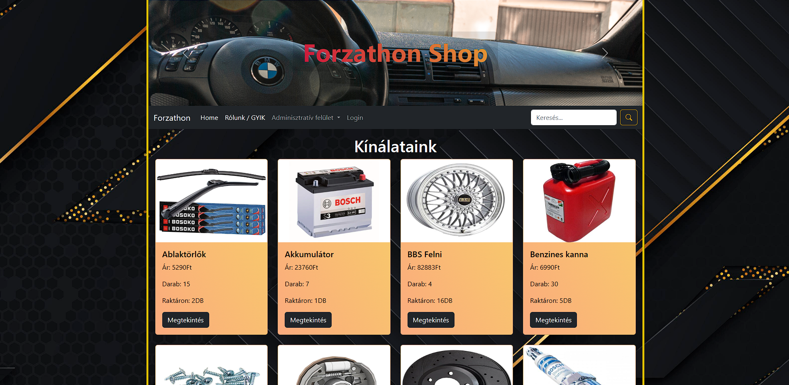

# A prodoktum használata

## HomeView
Miután végrehajtottuk a README.md file utasításait és minden szerver fut, akkor a főoldalt láthatjuk miután rámentünk a kliens linkjére.

Ez a webáruház főoldala abban az állapotban amikor nem vagyunk bejelentkezve.
Ez az úgynevezett "Guest" állapot. Ilyenkor az árukat csak nézegetni tudjuk a megtekintés gombbal, illetve a "Rólunk/GYIK" fülre kattintva a webáruház About szekcióját érjük el. Az áruk közt képesek vagyunk keresni a keresési mezővel de rendelni nem tudunk. 

## AboutView

A webáruházaknak általába van egy GYIK és egy elérhetőségi felülete. Itt ugyanezt a hatást szerettük volna elérni, hogy élethűbb legyen a munka.

## LoginView

Ez a webáruház bejelentkezési felülete amit a menübe lévő "Login" szó kattintása után érünk el. Itt egy már regisztált felhasználó felhasználónevét és jelszavát kell megadni. Amennyiben sikeresen beléptünk az oldal visszadob a webáruház főoldalára, immáron bejelentkezett státuszban.

Amennyiben nem sikerült a bejelentkezés egy hibaüzenetet kapunk ami egy kis idő után eltűnik.

## HomeView bejelentkezve

Ez a főoldal bejelentkezett állapota. A menüben immáron látjuk a kosarat és, hogy épp jelenpillanatba mennyi van benne. Emellé a "Login" megváltozott egy "Logout (felhasználónév)" felületre ami kattintásra kijelentkeztet és visszarakja a főoldalt alapállapotba. 

    Most, hogy bevagyunk jelentkezve az áruk megtekintés gombjára kattintva képesek vagyunk kosárba helyezni az árut.

    A vásárlás gombra kattintva a kosárba rakunk annyit az áruból amennyi kivan választva mellette. Csak annyit tudunk kiválasztani, ahány van az áruból.

Kosárba rakás után rátudunk kattintani a keresés melletti kosár ikonra ami egy listába megjeleníti, hogy miből és mennyit raktunk be a kosárba. Az egységár mellett az összárat is kiírja, feltéve ha egy áruból többet vásárolunk.

    Ha meggondoltuk magunkat, a kuka ikon kattintásával a kosárból kitudjuk szedni a nemkívánt árukat.